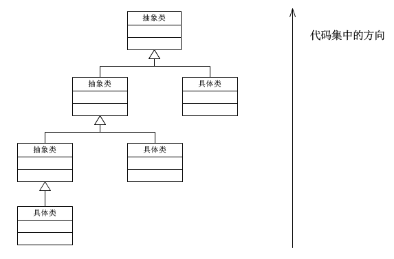

## 策略模式

### 定义

- 策略模式属于对象的行为模式；

- 策略模式定义了算法家庭，分别封装起来，让它们之间可以互相替换；
- 此模式让算法的变化，不会影响到使用算法的客户。

### 结构

　策略模式是对算法的包装，是把使用算法的责任和算法本身分割开来，委派给不同的对象管理。策略模式通常把一个系列的算法包装到一系列的策略类里面，作为一个抽象策略类的子类。用一句话来说，就是：“准备一组算法，并将每一个算法封装起来，使得它们可以互换”。


这个模式涉及到三个角色：

　　●　　**环境(Context)角色：**持有一个Strategy的引用。

　　●　　**抽象策略(Strategy)角色：**这是一个抽象角色，通常由一个接口或抽象类实现。此角色给出所有的具体策略类所需的接口。

　　●　　**具体策略(ConcreteStrategy)角色：**包装了相关的算法或行为。

### 源代码

环境角色类

```java
public class Context {
    //持有一个具体策略的对象
    private Strategy strategy;
    /**
     * 构造函数，传入一个具体策略对象
     * @param strategy    具体策略对象
     */
    public Context(Strategy strategy){
        this.strategy = strategy;
    }
    /**
     * 策略方法
     */
    public void contextInterface(){
        
        strategy.strategyInterface();
    }
}
```

抽象策略类

```java
public interface Strategy {
    /**
     * 策略方法
     */
    public void strategyInterface();
}
```

具体策略类

```java
public class ConcreteStrategyA implements Strategy {

    @Override
    public void strategyInterface() {
        //相关的业务
    }
}
```

```java
public class ConcreteStrategyB implements Strategy {

    @Override
    public void strategyInterface() {
        //相关的业务
    }
}
```

```java
public class ConcreteStrategyC implements Strategy {

    @Override
    public void strategyInterface() {
        //相关的业务
    }
}
```

### 使用场景

　　假设现在要设计一个贩卖各类书籍的电子商务网站的购物车系统。一个最简单的情况就是把所有货品的单价乘上数量，但是实际情况肯定比这要复杂。比如，本网站可能对所有的高级会员提供每本20%的促销折扣；对中级会员提供每本10%的促销折扣；对初级会员没有折扣。

　　根据描述，折扣是根据以下的几个算法中的一个进行的：

　　算法一：对初级会员没有折扣。

　　算法二：对中级会员提供10%的促销折扣。

　　算法三：对高级会员提供20%的促销折扣。

　　使用策略模式来实现的结构图如下：


**源代码**

抽象折扣类

```java
public interface MemberStrategy {
    /**
     * 计算图书的价格
     * @param booksPrice    图书的原价
     * @return    计算出打折后的价格
     */
    public double calcPrice(double booksPrice);
}
```

初级会员折扣类

```java
public class PrimaryMemberStrategy implements MemberStrategy {

    @Override
    public double calcPrice(double booksPrice) {
        
        System.out.println("对于初级会员的没有折扣");
        return booksPrice;
    }
}
```

中级会员折扣类

```java
public class IntermediateMemberStrategy implements MemberStrategy {

    @Override
    public double calcPrice(double booksPrice) {

        System.out.println("对于中级会员的折扣为10%");
        return booksPrice * 0.9;
    }
}
```

高级会员折扣类

```java
public class AdvancedMemberStrategy implements MemberStrategy {

    @Override
    public double calcPrice(double booksPrice) {
        
        System.out.println("对于高级会员的折扣为20%");
        return booksPrice * 0.8;
    }
}
```

价格类

```java
public class Price {
    //持有一个具体的策略对象
    private MemberStrategy strategy;
    /**
     * 构造函数，传入一个具体的策略对象
     * @param strategy    具体的策略对象
     */
    public Price(MemberStrategy strategy){
        this.strategy = strategy;
    }
    
    /**
     * 计算图书的价格
     * @param booksPrice    图书的原价
     * @return    计算出打折后的价格
     */
    public double quote(double booksPrice){
        return this.strategy.calcPrice(booksPrice);
    }
}
```

客户端

```java
public class Client {

    public static void main(String[] args) {
        //选择并创建需要使用的策略对象
        MemberStrategy strategy = new AdvancedMemberStrategy();
        //创建环境
        Price price = new Price(strategy);
        //计算价格
        double quote = price.quote(300);
        System.out.println("图书的最终价格为：" + quote);
    }
}
```

 　从上面的示例可以看出，策略模式仅仅封装算法，提供新的算法插入到已有系统中，以及老算法从系统中“退休”的方法，策略模式并不决定在何时使用何种算法。在什么情况下使用什么算法是由客户端决定的。

### 认识策略模式

　　**策略模式的重心**

　　策略模式的重心不是如何实现算法，而是如何组织、调用这些算法，从而让程序结构更灵活，具有更好的维护性和扩展性。

　　**算法的平等性**

　　策略模式一个很大的特点就是各个策略算法的平等性。对于一系列具体的策略算法，大家的地位是完全一样的，正因为这个平等性，才能实现算法之间可以相互替换。所有的策略算法在实现上也是相互独立的，相互之间是没有依赖的。

　　所以可以这样描述这一系列策略算法：策略算法是相同行为的不同实现。

　　**运行时策略的唯一性**

　　运行期间，策略模式在每一个时刻只能使用一个具体的策略实现对象，虽然可以动态地在不同的策略实现中切换，但是同时只能使用一个。

　　**公有的行为**

　　经常见到的是，所有的具体策略类都有一些公有的行为。这时候，就应当把这些公有的行为放到共同的抽象策略角色Strategy类里面。当然这时候抽象策略角色必须要用Java抽象类实现，而不能使用接口。

　　这其实也是典型的将代码向继承等级结构的上方集中的标准做法。



### 策略模式的优点

　　（1）策略模式提供了管理相关的算法族的办法。策略类的等级结构定义了一个算法或行为族。恰当使用继承可以把公共的代码移到父类里面，从而避免代码重复。

　　（2）使用策略模式可以避免使用多重条件(if-else)语句。多重条件语句不易维护，它把采取哪一种算法或采取哪一种行为的逻辑与算法或行为的逻辑混合在一起，统统列在一个多重条件语句里面，比使用继承的办法还要原始和落后。

### 策略模式的缺点

　　（1）客户端必须知道所有的策略类，并自行决定使用哪一个策略类。这就意味着客户端必须理解这些算法的区别，以便适时选择恰当的算法类。换言之，策略模式只适用于客户端知道算法或行为的情况。

　　（2）由于策略模式把每个具体的策略实现都单独封装成为类，如果备选的策略很多的话，那么对象的数目就会很可观。

### 参考

https://www.cnblogs.com/java-my-life/archive/2012/05/10/2491891.html