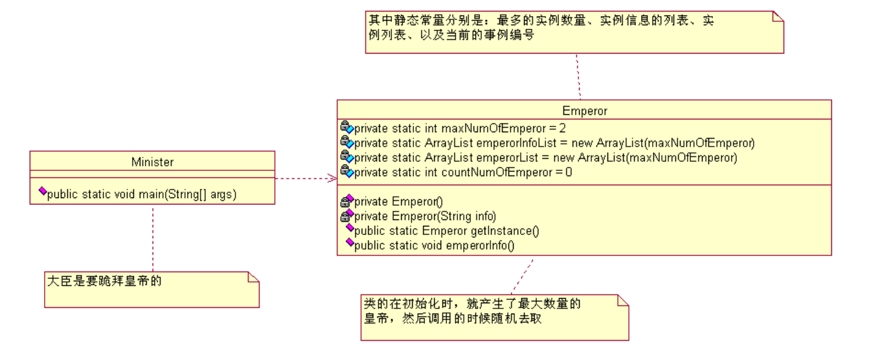

## 多例模式

​		除了单例模式之外还有多例设计模式，若果说单例设计模式只能有一个实例化对象，那么多例就有可以有多个实例化对象，相当于定义了类中对象的个数。比如说现在要定义一个星期时间数的类，那么他的对象只需要七个（天），再比如现在要写一个表示颜色基色的类，那么它的对象就只需要三个。

 **案例：**

　　多例模式：两个皇帝

​		这个场景放到我们设计模式中就是叫**有上限的多例模式**（**没上限的多例模式**太容易了，和你直接 new 一
个对象没啥差别，不讨论）怎么实现呢，先看类图：



**定义两个皇帝：**

```java
package com.cbf4life.singleton2;

import java.util.ArrayList;
import java.util.Random;

/**
* @author cbf4Life cbf4life@126.com
* I'm glad to share my knowledge with you all.
* 中国的历史上一般都是一个朝代一个皇帝，有两个皇帝的话，必然要PK出一个皇帝出来。
* 问题出来了：如果真在一个时间，中国出现了两个皇帝怎么办？比如明朝土木堡之变后，
* 明英宗被俘虏，明景帝即位，但是明景帝当上皇帝后乐疯了，竟然忘记把他老哥明英宗削为太上皇，
* 也就是在这一个多月的时间内，中国竟然有两个皇帝！
*
*/
@SuppressWarnings("all")
public class Emperor {
    
    //最多只能有连个皇帝
    private static int maxNumOfEmperor = 2; 
    
    //皇帝叫什么名字
    private static ArrayList emperorInfoList=new ArrayList(maxNumOfEmperor); 
    
    //装皇帝的列表
    private static ArrayList emperorList=new ArrayList(maxNumOfEmperor); 
    
    //正在被人尊称的是那个皇帝
    private static int countNumOfEmperor =0; 
    
    //先把2个皇帝产生出来
    static{
        //把所有的皇帝都产生出来
        for(int i=0;i<maxNumOfEmperor;i++){
        	emperorList.add(new Emperor("皇"+(i+1)+"帝"));
        }
    }
    
    //就这么多皇帝了，不允许再推举一个皇帝(new 一个皇帝）
    private Emperor(){
    	//世俗和道德约束你，目的就是不让你产生第二个皇帝
    }
    
    private Emperor(String info){
    	emperorInfoList.add(info);
    }
    
    public static Emperor getInstance(){
        Random random = new Random();
        //随机拉出一个皇帝，只要是个精神领袖就成
        countNumOfEmperor = random.nextInt(maxNumOfEmperor); 
        return (Emperor)emperorList.get(countNumOfEmperor);
    }
    
    //皇帝叫什么名字呀
    public static void emperorInfo(){
    	System.out.println(emperorInfoList.get(countNumOfEmperor));
    }
}
```

**定义大臣：**

```java
package com.cbf4life.singleton2;
/**
* @author cbf4Life cbf4life@126.com
* I'm glad to share my knowledge with you all.
* 大臣们悲惨了，一个皇帝都伺候不过来了，现在还来了两个个皇帝
* TND，不管了，找到个皇帝，磕头，请按就成了！
*/
@SuppressWarnings("all")
public class Minister {
    /**
    * @param args
    */
    public static void main(String[] args) {
        int ministerNum =10; //10个大臣
        for(int i=0;i<ministerNum;i++){
            Emperor emperor = Emperor.getInstance();
            System.out.print("第"+(i+1)+"个大臣参拜的是：");
            emperor.emperorInfo();
        } 
    }
}
```


