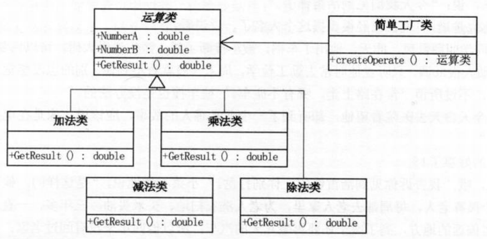
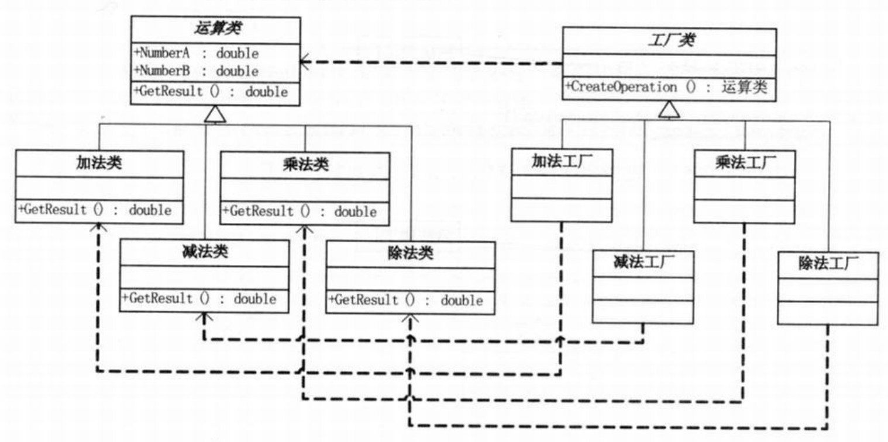
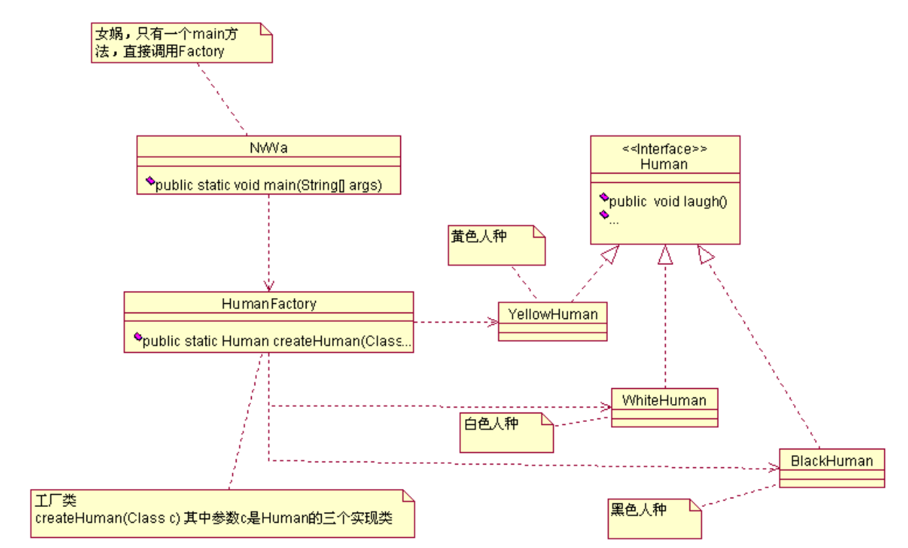
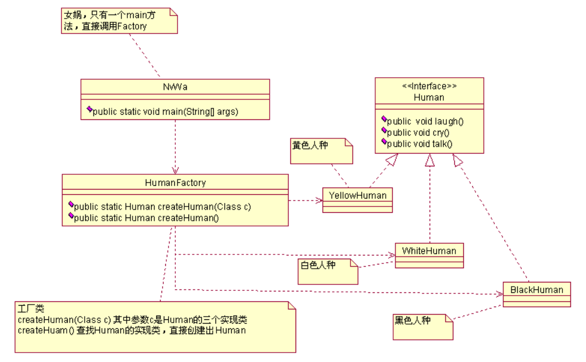

## 工厂方法模式

**定义一个用于创建对象的接口，让子类决定实例化哪一个类。工厂方法使一个类的实例化延迟到其子类。**

在阎宏博士的《JAVA与模式》一书中开头是这样描述工厂方法模式的：

　　**工厂方法模式是类的创建模式，又叫做虚拟构造子(Virtual Constructor)模式或者多态性工厂（Polymorphic Factory）模式。**

　　**工厂方法模式的用意是定义一个创建产品对象的工厂接口，将实际创建工作推迟到子类中。**

### 例一

#### 简单工厂模式

计算器为例，结构图如下：



**工厂类：**

```java
class OperationFactory {
    public static Operation createOperate(String operate) {
        //运算类
        Operation oper = null;
        switch (operate) {
            case "+":
                oper= new OperationAdd();
                break;
            case "-":
                oper = new OperationSub();
                break;
            case "*":
                oper = new OperationMul();
                break;
            case "/":
                oper = new OperationDiv();
                break;
        }
        return oper;
    }
}
```

**客户端代码：**

```java
Operation oper = OperationFactory.createOperate("+");
oper.NumberA = 1;
oper.NumberB = 2;
double result = oper.GetResult();
```

#### 工厂方法模式

结构图如下：



**工厂接口：**

```java
interface IFactory {
    Operation CreateOperation();
}
```

**加减乘除类实现接口**

```java
class AddFactory implements IFactory {
    public Operation CreateOperation(){
        return new OperationAdd();
    }
}
class SubFactory implements IFactory {
    public Operation CreateOperation(){
        return new OperationSub();
    }
}
class MulFactory implements IFactory {
    public Operation CreateOperation(){
        return new OperationMul();
    }
}
class DivFactory implements IFactory {
    public Operation CreateOperation(){
        return new OperationDiv();
    }
}
```

**客户端**

```java
IFactory operFactory = new AddFactory();
Operation oper = operFactory.CreateOperation();
oper.NumberA = 1;
oper.NumberB = 2;
double result = oper.GetResult();
```

> 工厂方法模式与简单工厂的区别：简单工厂模式的最大优点在于工厂类中包含了必要的逻辑判断，根据客户端的选择条件动态实例化相关的类，对于客户端来说，去除了与具体产品的依赖。
>
> 　　工厂方法模式和简单工厂模式在结构上的不同很明显。工厂方法模式的核心是一个抽象工厂类，而简单工厂模式把核心放在一个具体类上。
> 　　工厂方法模式退化后可以变得很像简单工厂模式。设想如果非常确定一个系统只需要一个具体工厂类，那么不妨把抽象工厂类合并到具体工厂类中去。由于只有一个具体工厂类，所以不妨将工厂方法改为静态方法，这时候就得到了简单工厂模式。

　　如果系统需要加入一个新的计算方式类型，那么所需要的就是向系统中加入一个这个计算方式类以及所对应的工厂类。没有必要修改客户端，也没有必要修改抽象工厂角色或者其他已有的具体工厂角色。对于增加新的计算方式类型而言，这个系统完全支持“**开-闭原则**”。

#### 总结

　　一个应用系统是由多人开发的，计算方式的功能是你实现的，但是使用者（调用这个方法的人）可能却是其他人。这时候你应该设计的足够灵活并尽可能降低两者之间的耦合度，当你修改或增加一个新的功能时，使用者不需要修改任何地方。假如你的设计不够灵活，那么将无法面对客户多变的需求。可能一个极小的需求变更，都会使你的代码结构发生改变，并导致其他使用你所提供的接口的人都要修改他们的代码。牵一处而动全身，这就使得日后这个系统将难以维护。

### 例二

> 利用“反射”可以解决避免分支判断的问题

女娲创造人为例：



**源代码**

定义人类总称

```java
package com.cbf4life;
/**
* @author cbf4Life cbf4life@126.com
* I'm glad to share my knowledge with you all.
* 定义一个人类的统称
*/
public interface Human {
    //首先定义什么是人类
    //人是愉快的，会笑的，本来是想用smile表示，想了一下laugh更合适，好长时间没有大笑了；
    public void laugh();
    //人类还会哭，代表痛苦
    public void cry();
    //人类会说话
    public void talk();
}
```

定义具体的人类

```java
/**
* @author cbf4Life cbf4life@126.com
* I'm glad to share my knowledge with you all.
* 黄色人类，这个翻译的不准确，将就点吧
*/
public class YellowHuman implements Human {
    public void cry() {
    	System.out.println("黄色人类会哭");
    }
    public void laugh() {
    	System.out.println("黄色人类会大笑，幸福呀！");
    }
    public void talk() {
    	System.out.println("黄色人类会说话，一般说的都是双字节");
    }
}

/**
* @author cbf4Life cbf4life@126.com
* I'm glad to share my knowledge with you all.
* 白色人类
*/
public class WhiteHuman implements Human {
    public void cry() {
    	System.out.println("白色人类会哭");
    }
    public void laugh() {
    	System.out.println("白色人类会大笑，侵略的笑声");
    }
    public void talk() {
    	System.out.println("白色人类会说话，一般都是但是单字节！");
    }
}

/**
* @author cbf4Life cbf4life@126.com
* I'm glad to share my knowledge with you all.
* 黑色人类，记得中学学英语，老师说black man是侮辱人的意思，不懂，没跟老外说话
*/
public class BlackHuman implements Human {
    public void cry() {
    	System.out.println("黑人会哭");
    }
    public void laugh() {
    	System.out.println("黑人会笑");
    }
    public void talk() {
    	System.out.println("黑人可以说话，一般人听不懂");
    }
}
```

八卦炉定义

```java
import java.util.List;
import java.util.Random;
/**
* @author cbf4Life cbf4life@126.com
* I'm glad to share my knowledge with you all.
* 今天讲女娲造人的故事，这个故事梗概是这样的：
* 很久很久以前，盘古开辟了天地，用身躯造出日月星辰、山川草木，天地一片繁华
* One day，女娲下界走了一遭，哎！太寂寞，太孤独了，没个会笑的、会哭的、会说话的东东
* 那怎么办呢？不用愁，女娲，神仙呀，造出来呀，然后捏泥巴，放八卦炉（后来这个成了太白金星的宝
贝）中烤，于是就有了人：
* 我们把这个生产人的过程用Java程序表现出来：
*/
public class HumanFactory {
    //定一个烤箱，泥巴塞进去，人就出来，这个太先进了
    public static Human createHuman(Class c){
        //定义一个类型的人类
        Human human=null; 
        try {
            //产生一个人类
        	human = (Human)Class.forName(c.getName()).newInstance(); 
        } catch (InstantiationException e) {
            //你要是不说个人类颜色的话，没法烤，要白的黑，你说话了才好烤
        	System.out.println("必须指定人类的颜色");
        } catch (IllegalAccessException e) { 
            //定义的人类有问题，那就烤不出来了，这是...
        	System.out.println("人类定义错误！");
        } catch (ClassNotFoundException e) { 
            //你随便说个人类，我到哪里给你制造去？！
        	System.out.println("混蛋，你指定的人类找不到！");
        }
        return human;
    }
}
```

女娲

```java
/**
* @author cbf4Life cbf4life@126.com
* I'm glad to share my knowledge with you all.
* 首先定义女娲，这真是额的神呀
*/
public class NvWa {
    public static void main(String[] args) {
        //女娲第一次造人，试验性质，少造点，火候不足，缺陷产品
        System.out.println("------------造出的第一批人是这样的：白人-----------------");
                           
        Human whiteHuman = HumanFactory.createHuman(WhiteHuman.class);
        whiteHuman.cry();
        whiteHuman.laugh();
        whiteHuman.talk();
        //女娲第二次造人，火候加足点，然后又出了个次品，黑人
        System.out.println("\n\n------------造出的第二批人是这样的：黑人-----------------");
                           
        Human blackHuman = HumanFactory.createHuman(BlackHuman.class);
        blackHuman.cry();
        blackHuman.laugh();
        blackHuman.talk();
        //第三批人了，这次火候掌握的正好，黄色人类（不写黄人，免得引起歧义），备注：RB人不属
        于此列
        System.out.println("\n\n------------造出的第三批人是这样的：黄色人类-----------------");

        Human yellowHuman = HumanFactory.createHuman(YellowHuman.class);
        yellowHuman.cry();
        yellowHuman.laugh();
        yellowHuman.talk()
    }
}
```

这样这个世界就热闹起来了，人也有了，但是这样创建太累了，神仙也会累的，那怎么办？神仙就想
了：我塞进去一团泥巴，随机出来一群人，管他是黑人、白人、黄人，只要是人就成（你看看，神仙都偷
懒，何况是我们人），先修改类图：



然后看我们的程序修改，先修改 HumanFactory.java，增加了 createHuman()方法：

```java
//女娲生气了，把一团泥巴塞到八卦炉，哎产生啥人类就啥人类
public static Human createHuman(){
    Human human=null; //定义一个类型的人类
    //首先是获得有多少个实现类，多少个人类
    List<Class> concreteHumanList =
        ClassUtils.getAllClassByInterface(Human.class); //定义了多少人类
    //八卦炉自己开始想烧出什么人就什么人
    Random random = new Random();
    int rand = random.nextInt(concreteHumanList.size());
    human = createHuman(concreteHumanList.get(rand));
    return human;
}
```

#### 总结

我们来总结一下，特别是增加了 createHuman()后，是不是这个工厂的扩展性更好了？你看你要再加一
个人类，只要你继续集成 Human 接口成了，然后啥都不用修改就可以生产了，具体产多少，那要八卦炉说
了算。

#### 重点补充内容

工厂方法模式还有一个非常重要的应用，就是延迟始化(Lazy initialization)，什么是延迟始化呢？
一个对象初始化完毕后就不释放，等到再次用到得就不用再次初始化了，直接从内存过中拿到就可以了，
怎么实现呢，很简单，看例子：

```java
import java.util.HashMap;
/**
* @author cbf4Life cbf4life@126.com
* I'm glad to share my knowledge with you all.
*/
@SuppressWarnings("all")
public class HumanFactory {
    // 定义一个 MAP, 初始化过的 Human 对象都放在这里
    private static HashMap<String,Human> humans = new HashMap<String,Human>();
    // 定一个烤箱，泥巴塞进去，人就出来，这个太先进了
    public static Human createHuman(Class c){
        // 定义一个类型的人类
        Human human=null; 
        try {
            // 如果 MAP 中有，则直接从取出，不用初始化了
            if(humans.containsKey(c.getSimpleName())){
            	human = humans.get(c.getSimpleName());
            }else{
                human = (Human)Class.forName(c.getName()).newInstance();
                // 放到 MAP 中
                humans.put(c.getSimpleName(), human);
            } 
        } catch (InstantiationException e) {
            // 你要是不说个人类颜色的话，没法烤，要白的黑，你说话了才好烤
            System.out.println(" 必须指定人类的颜色 ");
        } catch (IllegalAccessException e) { 
            // 一定定义的人类有问题，那就烤不出来了，这是 ...
            System.out.println(" 人类定义错误！ ");
        } catch (ClassNotFoundException e) { 
            // 你随便说个人类，我到哪里给你制造去？！
        	System.out.println(" 混蛋，你指定的人类找不到！ ");
        }
        return human;
    }
}
```

通过map，把对象放到map中去，每次初始化时，先查询map中是否存在对象