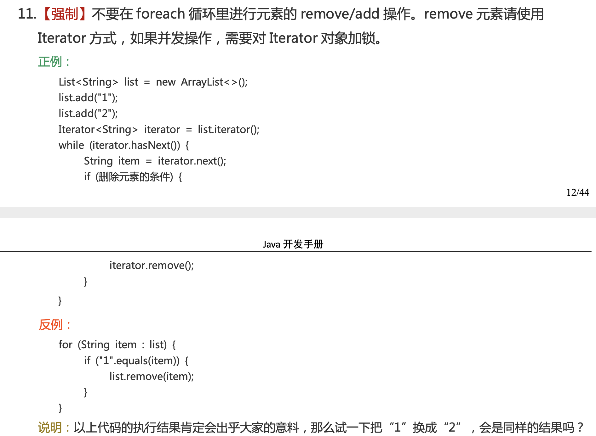

### 1.异常记录

#### 1.1.ConcurrentModificationException异常

(并发修改异常)

> java.util包下的集合类都是快速失败机制的, 不能在多线程下发生并发修改(迭代过程中被修改).

##### 1.1.1.是什么呢？

- 在使用迭代器对集合进行遍历的时候，我们在多线程下操作非安全失败（fail-safe）的集合类可能就会触发fail-fast（快速失败）机制，导致抛出该异常。

- 在单线程下，如果在遍历过程中对集合对象的内容进行了修改的话也会触发fail-fast（快速失败）机制。

> 注：增强 for 循环也是借助迭代器进行遍历。

举个例子：多线程下，如果线程 1 正在对集合进行遍历，此时线程 2 对集合进行修改（增加、删除、修改），或者线程 1 在遍历过程中对集合进行修改，都会导致线程 1 抛出 `ConcurrentModificationException` 异常。

##### 1.1.2.为什么呢？

每当迭代器使用 `hashNext()`/`next()`遍历下一个元素之前，都会检测 `modCount` 变量是否为 `expectedModCount` 值，是的话就返回遍历；否则抛出异常，终止遍历。

如果我们在集合被遍历期间对其进行修改的话，就会改变 `modCount` 的值，进而导致 `modCount != expectedModCount` ，进而抛出 `ConcurrentModificationException` 异常。

> 注：通过 `Iterator` 的方法修改集合的话会修改到 `expectedModCount` 的值，所以不会抛出异常。

```java
final void checkForComodification() {
    if (modCount != expectedModCount)
        throw new ConcurrentModificationException();
}
```

##### 1.1.3.怎么解决呢？



#### 1.2.UnsupportedOperationException异常

(不支持操作异常)

##### 1.2.1.是什么呢？

该异常是在操作不支持的操作时抛出。

##### 1.2.2.为什么呢？

方法.png)

##### 1.2.3.怎么解决呢？

不使用这类的API，如Arrays里的内部类ArrayList的操作add/remove/clear，这个内部类并没有实现集合的修改方法或者说并没有重写这些方法。